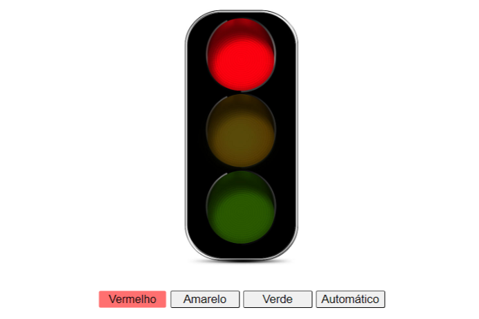
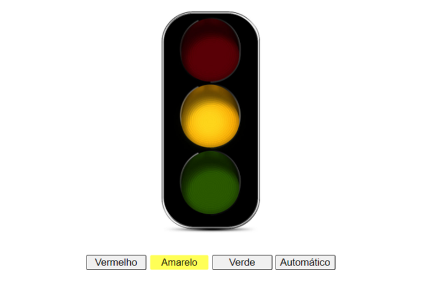
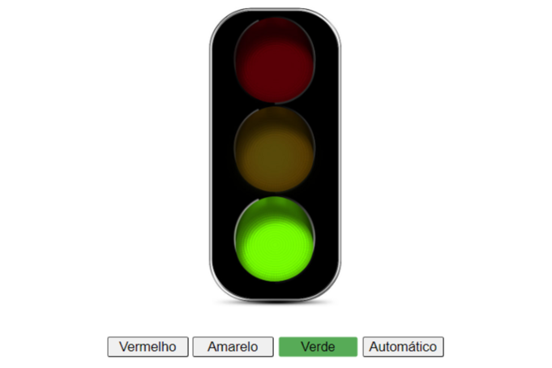

<h1>Traffic-Light</h1>

 
 
 

 <h2>Sumário</h2>
 <ul>
   <li><a href="#proj">Projeto</a> 
     <li><a href="#desc">Descrição</a> 
      <li><a href="#prer">Pré-requesito</a> 
   <li><a href="#config">Configuração</a> 
 </ul> 

<h2 id="proj">Projeto</h2>

|  |  |
| ------------------------------------------------- | ---------------------------------------------- |
|  |                                              |

<h2 id="desc">Descrição</h2>

A proposta deste projeto é controlar as cores de um semáforo, onde cada botão representa uma cor, ou mesmo, coloca-lo no automático. As cores começam do vermelho, amarelo e finalizam no verde.

<h2 id="prer">Pré-requesito</h2>

<ul>
  <li>Ter Git o instalado na sua máquina</li>
</ul>

<h2 id="config">Configuração</h2>
  <ol>
    <li>cd pasta-do-projeto</li>
    <li>git clone</li>
    
        git clone https://github.com/sthevenalves/traffic-light.git
  </ol>
  

